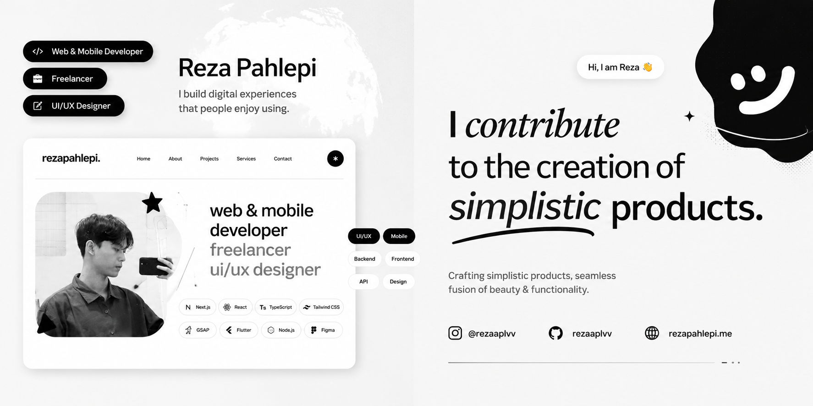

  

 

  

 

  <table border="0" width="95%" cellspacing="0" cellpadding="0">
    <tr>
      <td bgcolor="#0d1117" style="border: 1px solid #30363d; border-radius: 8px; padding: 25px;">
        <table border="0" width="100%">
          <tr>
            <td width="60%" valign="top">
              <code style="color: #58a6ff; font-size: 14px;">// IDENTITY_STATION.</code>
              <h2 align="left" style="margin-top: 5px; border-bottom: none;">Reza Pahlepi</h2>
              

                <code>DEGREE :</code> <kbd>Informatics Engineering</kbd>  
                <code>FOCUS  :</code> <kbd>Android Enthusiast with a lean toward UI/UX.</kbd>  
                <code>PASSION :</code> <kbd>Finding joy in digital artistry and visual experimentation.</kbd>
              

               
              <code style="color: #8b949e; font-style: italic;"># "Code is like humor. When you have to explain it, it’s bad."</code>
            </td>
            <td width="40%" valign="top" align="right">
              <code style="color: #58a6ff; font-size: 14px;">// SYSTEM_STATUS</code>
                
              <code>KNOWLEDGE_BASE</code>  
              
                
              <code>DESIGN_STRENGTH</code>  
              
            </td>
          </tr>
        </table>
        

        

          
          
          &nbsp; <code style="font-size: 11px; color: #8b949e;">[ SYSTEM_READY_FOR_COLLABORATION ]</code>
        

      </td>
    </tr>
  </table>

---

  <h3>Languages & Tools</h3>
   
  

---

  <h3> GitHub Analytics</h3>
   
  
    
  

 

  

